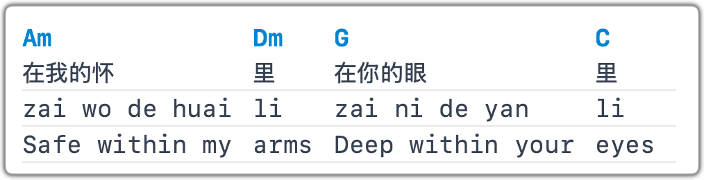

# A Multilingual Chord Viewer

**Ever need to practice singing in a language that your teacher doesn't speak in?**

The web app renders **multiple lyric tracks** with **aligned chord columns, language toggles, transposition, and optional YouTube embeds**. So now you can provide phonetic transcription and translations for your singing teacher.


## Web App

```bash
npm install
npm run dev        # dev server (binds to 0.0.0.0 — accessible on local network)
npm run build      # production build → dist-web/
```

### The Extended Chord Bracket (ECB) Format

Each sound is noted in the extended chord bracket (ECB). See `format_spec/when_you_are_old.ecb` for an example file and the specification of this format. For example, the first line of Baikal Lake is noted as follows:

```
[Am]在我的怀|zai wo de huai|Safe within my [Dm]里|li|arms [G]在你的眼|zai ni de yan|Deep within your [C]里|li|eyes
```

Languages for the lyrics separated by the vertical bars are specified by a parameter in the header of the ECB file: `%%languages chinese, pinyin, english`.


### Web Viewer Features

- **Language toggles** — show/hide individual language rows per song
- **Transposition** — semitone `−`/`+` control; *Transcribed* and *Actual* preset buttons (when `%%transpose` is set)
- **YouTube embed** — appears below metadata when `%%youtube` is set
- **Show Source** — expandable raw ECB view with a copy button

(Metadata configuration keys recognized by the web viewer: `title`, `artist`, `languages`, `transpose`, `youtube`)

---

<details>
<summary>Legacy pipeline (deprecated)</summary>

The original purpose of this repo was to add pinyin to Ultimate Guitar tabs using an LM via an intermediate JSON representation (IR).

### Pipeline

1. **Tab → IR** — Parse Ultimate Guitar tab with ChordSheetJS, emit IR (JSON).
2. **Agent** — Edit the JSON: fill the `pinyin` field for each segment (e.g. with an agentic LM).
3. **IR → Tab** — Convert IR back to chord tab (ChordSheetJS `ChordsOverWordsFormatter`).

### Setup

```bash
npm install
npm run build
```

Source is in `src/`, compiled output in `dist/`.

### Usage

#### Tab → IR (JSON)

```bash
npm run tab-to-ir -- convert/jrayty-in.txt
# Writes convert/jrayty-in.ir.json

npm run tab-to-ir -- convert/jrayty-in.txt out.ir.json
```

#### IR → Tab

```bash
npm run ir-to-tab -- convert/jrayty-in.ir.json
npm run ir-to-tab -- convert/jrayty-in.ir.json converted.txt
```

#### Round-trip (sanity check)

```bash
npm run roundtrip -- convert/jrayty-in.txt convert/jrayty-roundtrip.txt
```

### IR format (JSON)

`{ "meta": {}, "paragraphs": [ { "type": "verse"|"chorus"|…, "lines": [ { "segments": [ { "chord", "lyrics", "pinyin" } ] } ] } ] }`

Full specification: [docs/ir-json-spec.md](docs/ir-json-spec.md)

### Agent workflow

1. Run `npm run tab-to-ir -- your-song.txt` to get `your-song.ir.json`.
2. Have your agent edit the JSON: set the `pinyin` field for each segment in `paragraphs[].lines[].segments[]`.
3. Run `npm run ir-to-tab -- your-song.ir.json your-song-with-pinyin.txt`.

### Docs

- [IR JSON specification](docs/ir-json-spec.md)
- [Fixed-width rendering (CJK alignment)](docs/fixed-width-rendering.md)
- [ChordSheetJS](https://martijnversluis.github.io/ChordSheetJS/)

</details>
