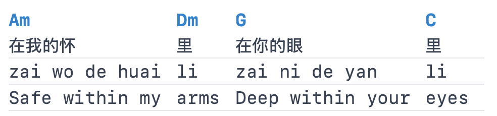

# A Multilingual Chord Viewer

Did you...

- Need to rehearse a song with someone who can’t read the lyrics’ language?
- Try to study a song across a language barrier?
- Wish your singing partner could follow along without speaking the language of the lyrics?

Then fear not, Multilingual Chord Viewer is the solution for you. The web app renders **multiple lyric tracks** with **aligned chord columns, language toggles, transposition, and optional YouTube embeds**. So now you can provide phonetic transcription and translations for your singing teacher.


## Web App

```bash
npm install
npm run dev        # dev server (binds to 0.0.0.0 — accessible on local network)
npm run build      # production build → dist-web/
```

### The Extended Chord Bracket (ECB) Format

Each sound is noted in the extended chord bracket (ECB). See `format_spec/when_you_are_old.ecb` for an example file and the specification of this format. For example, the first line of Baikal Lake is noted as follows:

```
[Am]在我的怀|zai wo de huai|Safe within my [Dm]里|li|arms [G]在你的眼|zai ni de yan|Deep within your [C]里|li|eyes
```

Languages for the lyrics are specified by a parameter in the header of the ECB file. For example:

```
%%languages chinese, pinyin, english
```


### Web Viewer Features

- **Language toggles** — show/hide individual language rows per song
- **Transposition** — semitone `−`/`+` control; *Transcribed* and *Actual* preset buttons (when `%%transpose` is set)
- **YouTube embed** — appears below metadata when `%%youtube` is set
- **Show Source** — expandable raw ECB view with a copy button

(Metadata configuration keys recognized by the web viewer: `title`, `artist`, `languages`, `transpose`, `youtube`)

---

<details>
<summary>Legacy pipeline (deprecated)</summary>

The original purpose of this repo was to add pinyin to Ultimate Guitar tabs. That workflow now converts an Ultimate Guitar tab straight to ECB in a single step — no separate JSON step, no manual editing pass.

### Setup

```bash
npm install
npm run build:cli
```

Source is in `src/`, compiled output in `dist/`.

### Usage

```bash
npm run tab-to-ecb -- <input.txt> [output.ecb] [--pinyin] [--both]
```

- With no flags, the tab's lyric text is parsed as the song's lyrics.
- `--pinyin` — treat the tab's lyric text as pinyin instead (lyrics stay empty).
- `--both` — parse both pinyin and Chinese simultaneously: chord+pinyin lines are paired by ChordSheetJS, with a following CJK-only line distributed as lyrics across segments.

If `output.ecb` is omitted, the output is written next to the input file with a `.ecb` extension.

```bash
npm run tab-to-ecb -- convert/jrayty-in.txt
# Writes convert/jrayty-in.ecb

npm run tab-to-ecb -- convert/jrayty-in.txt out.ecb --both
```

### Docs

- [Fixed-width rendering (CJK alignment)](docs/fixed-width-rendering.md)
- [ChordSheetJS](https://martijnversluis.github.io/ChordSheetJS/)

</details>
